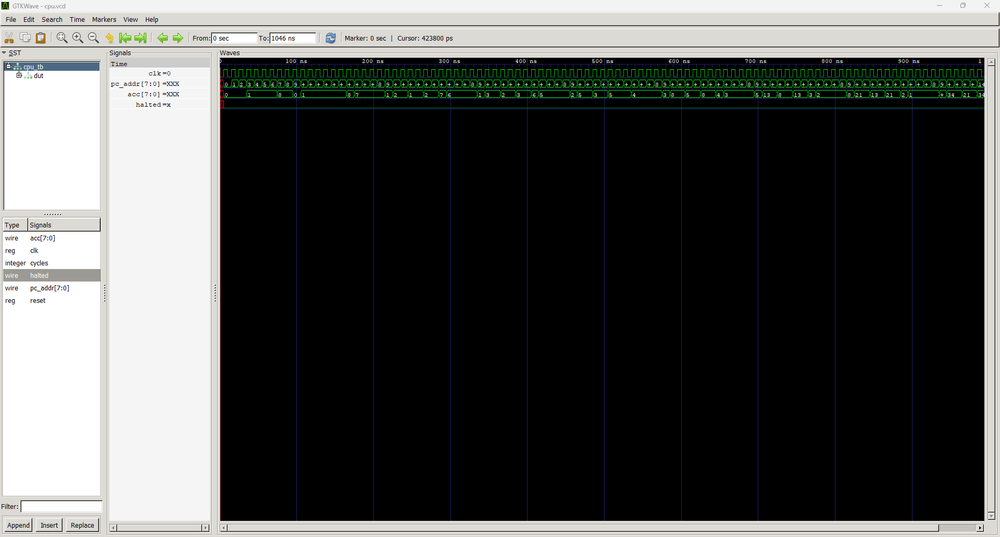

# 8-Bit CPU in Verilog

A complete 8-bit processor built from scratch in Verilog, with a custom instruction
set architecture and a two-pass assembler written in Python. Runs an iterative
Fibonacci program end to end in simulation.

Built with Icarus Verilog. No external IP and no generated cores — every module is
written by hand.

(README MADE WITH AI)
---

## Demo

```
$ python asm.py fib.asm program.hex
assembled 22 instructions into program.hex

$ iverilog -o cpu_sim alu.v regfile.v pc.v imem.v control.v cpu.v cpu_tb.v
$ vvp cpu_sim
halted after 104 cycles
acc = 34   expected 34
r1  = 21   r2 = 34
```


34 is the 9th Fibonacci number, computed by the processor from the program in
`fib.asm`.

The cycle count is exact and fully accounted for:

| Cycles | Work |
|-------:|------|
| 8 | Setup — initialise the registers and the loop counter |
| 84 | 7 complete loop iterations at 12 instructions each |
| 11 | 8th iteration, exits early at the branch |
| 1 | Final `LD r2` |
| **104** | **Total** |

---

## Architecture

Single-cycle design — fetch, decode, and execute all complete within one clock
period.

```
         +----------+
         |    PC    |<-------- jump target
         +----+-----+
              | address
              v
         +----------+
         |   IMEM   |   256 x 8 instruction memory
         +----+-----+
              | instruction
              v
         +----------+
         | CONTROL  |   opcode -> control signals
         +----+-----+
              |
      +-------+--------+
      v                v
 +----------+    +----------+
 | REGFILE  |--->|   ALU    |
 |  8 x 8   |    |          |
 +----------+    +----+-----+
      ^               |
      |          +----v-----+
      +----------|   ACC    |   accumulator
                 +----------+
```

---

## Instruction Set

Instructions are 8 bits wide: a 3-bit opcode and a 5-bit operand.

```
  bit:  7  6  5  4  3  2  1  0
        \__opcode__/\___operand___/
```

| Opcode | Mnemonic | Operand   | Operation                    |
|--------|----------|-----------|------------------------------|
| `000`  | `LDI`    | immediate | `ACC = immediate`            |
| `001`  | `LD`     | register  | `ACC = reg[rs]`              |
| `010`  | `ST`     | register  | `reg[rd] = ACC`              |
| `011`  | `ADD`    | register  | `ACC = ACC + reg[rs]`        |
| `100`  | `SUB`    | register  | `ACC = ACC - reg[rs]`        |
| `101`  | `JMP`    | address   | `PC = address`               |
| `110`  | `JZ`     | address   | `PC = address` if `ACC == 0` |
| `111`  | `HALT`   | none      | freeze the program counter   |

Register operands use the low 3 bits (`r0` through `r7`). Immediates and jump
targets use all 5 bits, giving a range of 0 to 31.

**Encoding example:** `ADD r2` is opcode `011`, operand `00010`, which packs to
`0110 0010` = `0x62`.

---

## Example Program

`fib.asm` — the program shown in the demo:

```
; fibonacci on the 8 bit accumulator cpu
; leaves the eighth fibonacci number in the accumulator

        LDI 0
        ST  r1          ; previous
        LDI 1
        ST  r2          ; current
        LDI 1
        ST  r5          ; a constant one to subtract with
        LDI 8
        ST  r4          ; loop counter

loop:   LD  r1
        ADD r2          ; acc = previous + current
        ST  r3
        LD  r2
        ST  r1          ; previous = current
        LD  r3
        ST  r2          ; current = next
        LD  r4
        SUB r5          ; counter = counter - 1
        ST  r4
        JZ  done
        JMP loop

done:   LD  r2
        HALT
```

---

## Design Decisions

**Accumulator architecture.**
With 8-bit instructions and 8 registers, a conventional three-operand format
(`ADD rd, ra, rb`) requires 9 bits of register addressing alone, before any
opcode. Making one operand implicit reduces this to a single 3-bit register
field, leaving 3 bits for the opcode and 2 to spare. This is the same tradeoff
made by the PDP-8 and the 6502.

**Single-cycle execution.**
Every instruction completes in one clock cycle, which keeps the control logic
purely combinational and makes the design straightforward to verify. The
tradeoff is clock period: it is set by the slowest instruction's complete path,
so the machine runs no faster than its worst case. Pipelining is the standard
remedy and is listed under extensions below.

**Defaults before the opcode case.**
Every control signal is assigned a default value before the `case` statement in
`control.v` runs. Without this, any code path that leaves a signal unassigned
causes Verilog to infer a latch, introducing unintended state into what should
be purely combinational logic. This is one of the most common real bugs in HDL
design.

**Branch tests the accumulator, not the ALU flag.**
`JZ` reads `ACC == 0` directly rather than the ALU's zero output, because the
accumulator may have been loaded by `LDI` or `LD` rather than produced by a
calculation. The ALU's zero flag is implemented and available, but this
instruction set does not depend on it.

**Priority ordering in the program counter.**
`pc.v` resolves its inputs in the order reset, halt, jump, increment. That
ordering is a design decision rather than an accident — swapping halt and jump
would produce a processor that keeps branching after it has stopped.

---

## Repository Layout

| File | Description |
|------|-------------|
| `alu.v` | 8-bit ALU — add, subtract, AND, OR, XOR, plus a zero flag |
| `regfile.v` | 8 x 8-bit register file, two read ports and one gated write port |
| `pc.v` | Program counter with reset, jump, and halt |
| `imem.v` | 256 x 8 read-only instruction memory, loaded via `$readmemh` |
| `control.v` | Combinational opcode decoder producing all control signals |
| `cpu.v` | Top-level datapath, accumulator, and accumulator source multiplexer |
| `asm.py` | Two-pass assembler with label resolution |
| `fib.asm` | Fibonacci program in the custom assembly language |
| `program.hex` | Assembled machine code consumed by `imem.v` |
| `alu_tb.v` | ALU testbench — all five operations and the zero flag |
| `regfile_tb.v` | Register file testbench — storage, write-enable gating, initialisation |
| `control_tb.v` | Decoder testbench — every opcode and both branch conditions |
| `fetch_tb.v` | Fetch unit testbench — program counter and instruction memory together |
| `cpu_tb.v` | Full-system testbench — runs until halt and checks the result |

---

## Building and Running

### Requirements

- [Icarus Verilog](http://iverilog.icarus.com/) 12.0
- Python 3
- [GTKWave](http://gtkwave.sourceforge.net/) — optional, for waveforms

### Run the processor

```
python asm.py fib.asm program.hex
iverilog -o cpu_sim alu.v regfile.v pc.v imem.v control.v cpu.v cpu_tb.v
vvp cpu_sim
```

### Run the individual testbenches

```
iverilog -o alu_sim     alu.v     alu_tb.v      && vvp alu_sim
iverilog -o regfile_sim regfile.v regfile_tb.v  && vvp regfile_sim
iverilog -o control_sim control.v control_tb.v  && vvp control_sim
iverilog -o fetch_sim   pc.v imem.v fetch_tb.v  && vvp fetch_sim
```

### View waveforms

Every testbench dumps a `.vcd` trace:

```
gtkwave cpu.vcd
```

---

## Verification

Each module has a dedicated testbench that prints actual results alongside the
expected values, so a regression is visible at a glance rather than requiring
manual inspection of a waveform.

| Testbench | What it proves |
|-----------|----------------|
| `alu_tb` | All five operations produce correct results, and the zero flag asserts only when the result is zero |
| `regfile_tb` | Values persist across clock cycles, `we` genuinely gates writes, and registers initialise to zero |
| `control_tb` | Every opcode decodes to the correct control signals, and `JZ` asserts `pc_load` only when the accumulator is zero |
| `fetch_tb` | The program counter and instruction memory fetch consecutive instructions with no external driving |
| `cpu_tb` | The assembled program executes to completion and produces the correct result |

The assembler is validated independently by assembling `fib.asm` and comparing
the output byte-for-byte against hand-encoded machine code:

```
python asm.py fib.asm program_check.hex
fc program.hex program_check.hex
```

---

## Possible Extensions

- **Pipeline the datapath** and handle the resulting data and control hazards
- **Add data memory** with load and store instructions for addressable RAM
- **Synthesize to an FPGA** such as a Tang Nano and drive real I/O
- **Widen instructions to 16 bits** to support a three-operand register ISA
- **Extend the assembler** with pseudo-instructions, named constants, and `.org`
